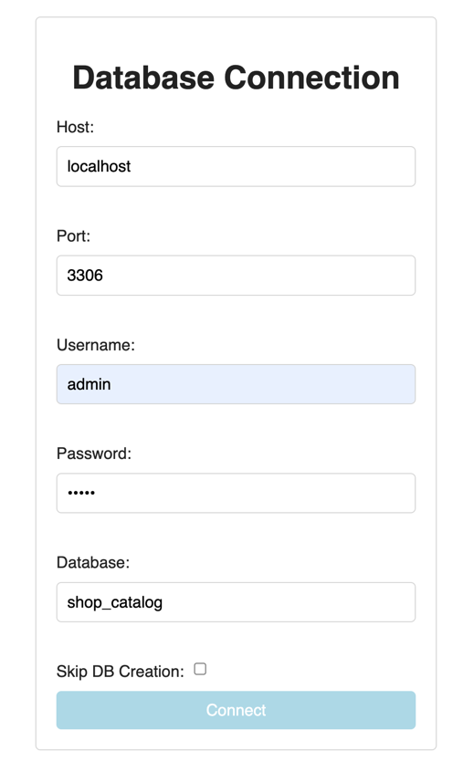
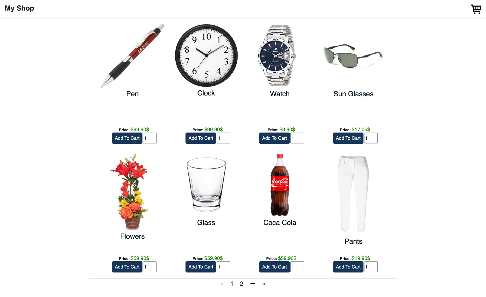

# ZenFlux demo projects.

## shop-catalog

This is a demo project for ZenFlux. It is a simple catalog of products.

shop-catalog uses both
- `@zenflux/core`
- `@zenflux/redux`

### Currently, it includes:
#### Backend:
- PHP vanilla backend
- Require PHP 7.4

### Frontend:
- React
- Redux

### What inside
- _Controllers_:
    - **Cart/Controller** - To handle cart items.
    - **Cart/Item/Controller** - To handle cart item.

    - **Catalog/Controller** - To handle catalog items per page.
    - **Catalog/Item/Controller** - To handle catalog item details.

    - **Components/Pagination/Controller** - To handle pagination.
    - **Layout/Sidebar/Controller** - Toggle the sidebar, print cart.

- _Router Controllers_:
    - **Pages/Controller** - Mange which page to show Catalog/Checkout
    - **Welcome/Controller** - Determine if the backend available and to setup the database connection/show errors.


- _Pure React Components_:
    - **Spinner**.
    - **Transaction**.
    - **Navbar**.

- _Components with controllers_:
    - **Pagination** - Uses simple controller to handle user actions.
    - **Catalog**
    - **Cart**
    - **Sidebar**

- _Components with router controllers_:
    - **Welcome** - Use router controller to show different components depends on the needs.
        - Error component.
        - Welcome component - Setup DB.
    - **Pages**:
        - Catalog - Show catalog page.
        - Checkout - Show checkout page.

# Installation
### Get the repo:
```shell
git clone https://github.com/ZenFlux/demos
```

### Enter repo folder:
```shell
npm install
```

### Run the backend:
```shell
npm run shop-catalog:backends:php:vanila:start
```

### Turn on new session & enter frontend folder:
```shell
npm run shop-catalog:frontends:react:start
```

### Enter the frontend:
http://localhost:3000

### Setup the database connection:

- Press connect.
- Wait few seconds till the pages reloaded.

#### And walla, you have a working catalog:

